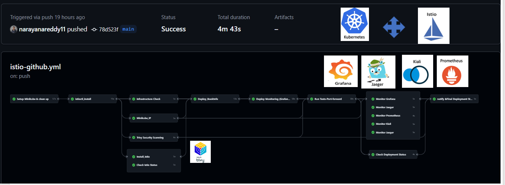

# 🚀 BookInfo CI/CD Pipeline with Istio on Minikube

This repository contains a robust CI/CD pipeline built using **GitHub Actions** to automate the deployment of the **BookInfo application** on **Minikube with Istio service mesh**, integrated with **monitoring tools (Grafana, Prometheus, Kiali, Jaeger, Zipkin)** and **security scanning (Trivy)**.

📷 Screenshots (Optional)
You can add screenshots of:


BookInfo app:

Grafana dashboards:

Kiali Service Mesh view:

Jaeger traces:

Zipkin :

Prometheus:

## Overview
The **Bookinfo** application consists of multiple microservices demonstrating Istio's capabilities, including traffic routing, observability, and security enforcement. It includes:
- **Productpage** (User-facing service)
- **Details** (Provides book details)
- **Reviews** (Multiple versions exist, one uses ratings)
- **Ratings** (Provides book ratings)


## 🧭 Pipeline Stages

| Stage | Description |
|-------|-------------|
| **MiniKube_Setup** | Start or resume Minikube cluster |
| **istioctl_install** | Install Istio CLI and perform prechecks |
| **Minikube_IP** | Fetch and display Minikube IP address |
| **Install_Istio** | Install Istio in demo profile and enable injection |
| **Deploy_BookInfo** | Deploy BookInfo application and gateway |
| **check-istio** | Verify Istio setup status |
| **infra-check** | Validate Kubernetes, Minikube, and Istio status |
| **deploy-monitoring** | Deploy monitoring tools in `istio-system` namespace |
| **monitor-[tools]** | Collect dashboard URLs and logs for tools |
| **security-scan** | Perform Trivy scans on BookInfo container images |
| **run-tests** | Port-forward dashboards and verify access logs |
| **deployment-status** | Check app status and gateway URL |
| **notify** | Send email summary and job status |
| **cleanup** | Clean up previous resources |
| **deploy** | Final output with endpoint links |

---
## Useful Commands
| Action | Command |
|--------|---------|
| Get Minikube IP | `minikube ip` |
| List Pods | `kubectl get pods -A` |
| Describe a Pod | `kubectl describe pod <POD_NAME>` |
| Check Istio Precheck | `istioctl x precheck` |
| List Istio Services | `kubectl get svc -n istio-system` |
| Delete Minikube Cluster | `minikube delete` |


## Step-by-Step Guide

### Step 1: Setup Minikube
```bash
minikube start --cpus=4 --memory=8192 --kubernetes-version=v1.32.0 --driver=virtualbox
```

### Step 2: Install Istio
```bash
curl -L https://istio.io/downloadIstio | ISTIO_VERSION=1.25.0 sh -
export PATH=$HOME/.istioctl/bin:$PATH
istioctl install --set profile=demo -y
kubectl label namespace default istio-injection=enabled
```

### Step 3: Deploy BookInfo Application
```bash
kubectl apply -f bookinfo.yaml
kubectl apply -f bookinfo-gateway.yaml
kubectl rollout status deployment/productpage-v1 -n default
```

### Step 4: Deploy Monitoring Tools
```bash
kubectl create namespace istio-system
kubectl apply -f moniter/
kubectl rollout status deployment/grafana -n istio-system
kubectl rollout status deployment/prometheus -n istio-system
kubectl rollout status deployment/kiali -n istio-system
```

### Step 5: Verify Deployments
Check URLs for the following services:
- **BookInfo Product Page:** `http://<MINIKUBE_IP>:<GATEWAY_PORT>/productpage`
- **Grafana Dashboard:** `http://localhost:3000`
- **Prometheus Dashboard:** `http://localhost:9090`
- **Kiali Dashboard:** `http://localhost:20001`
- **Jaeger Dashboard:** `http://localhost:16686`

### Step 6: Security Scan
To scan images with Trivy:
```bash
trivy image istio/examples-bookinfo-productpage-v1:1.20.2
```

### Step 7: Run Tests and Port-Forwarding
```bash
nohup istioctl dashboard kiali > logs/kiali-dashboard.log 2>&1 &
nohup istioctl dashboard prometheus > logs/prometheus-dashboard.log 2>&1 &
nohup istioctl dashboard grafana > logs/grafana-dashboard.log 2>&1 &
nohup istioctl dashboard jaeger > logs/jaeger-dashboard.log 2>&1 &
```

### Step 8: Cleanup
To clean up resources:
```bash
kubectl delete all --all --namespace=default
kubectl delete all --all -n istio-system
```

---


### Check Running Pods
```bash
kubectl get pods
```
Expected Output:
```bash
NAME                              READY   STATUS    RESTARTS   AGE
details-v1-7f556f5c6b-485l2       2/2     Running   0          10m
productpage-v1-84c8f95c8d-tlml2   2/2     Running   0          10m
ratings-v1-66777f856b-2ls78       2/2     Running   0          10m
reviews-v1-64c47f4f44-rx642       2/2     Running   0          10m
reviews-v2-66b6b95f44-s5nt6       2/2     Running   0          10m
reviews-v3-7f69dd7fd4-zjvc8       2/2     Running   0          10m
```

### Test Using CLI
```bash
kubectl exec -it "$(kubectl get pod -l app=ratings -o jsonpath='{.items[0].metadata.name}')" -c ratings -- curl productpage:9080/productpage | grep -o "<title>.*</title>"
```
Expected Output:
```bash
<title>Simple Bookstore App</title>
```

### Test Using Browser
```bash
http://<MINIKUBE_IP>:31395/productpage
```

## Cleanup
To clean up the deployed resources, run:
```bash
kubectl delete all --all --namespace=default
```


